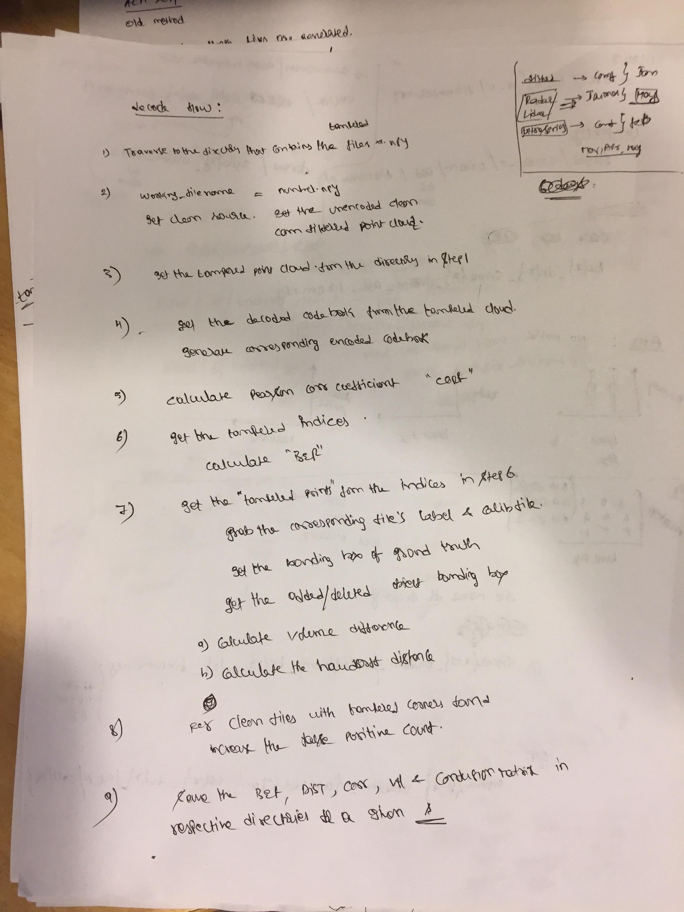
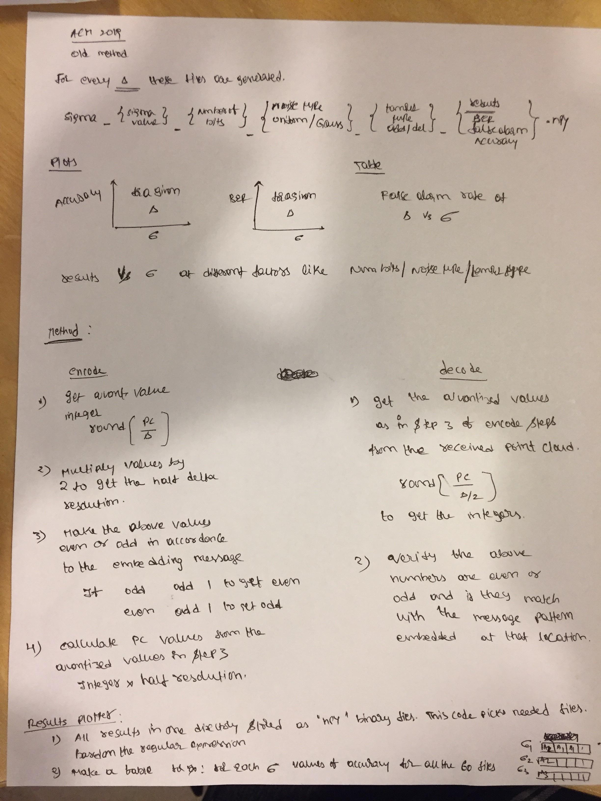

## This project displays the KittiLiDAR data and computes clustering - This is the initial commit of the roject
* The data folder has multiple kitti LiDAR point clouds that the clustering algorithm would run on and produces the bounding box indices of those clusters.
* helper functions contain all the helper functions tath deal with the point clouds
* kitti_clustering hs the code that does the clustering using eucedian distance. It has code to extract multiple clusters from the LiDAR data and display them in rviz. Use the rviz config file in the rviz_config directory
* pointcloud_reader.py would provide functions to read the point cloud, understand the voxelization, camera filtering and the quantization parts.

### branch quantizationwatermarking_correlationtests
* This branch sets up code to perform watermarking and correlation tests in the file watermarking_correlation.py

## notes on clustering and kd trees
* At the tx and rx end
    get clusters and make np array of bounding boxes (index X rows X columns). Where index or the axis 0 is the number of the cluster
    populate the cluster_centeroid = centeroid of the clusters ( index X rows X column). Here, rows = 1, columns = 3
    filter the centeroids based on the location (your zone of interest) and update the new cluster centeroids. 
    Add Gaussian noise at the z-axis of the clusters that are filtered and here we could increase the sigma based on the distance (x)

* decoding steps
    first compare the lengths of the clusters for both tx and rcv files.
    convert cluster_centeroid points to kd tree to make the search optimal (optional)
    starting with the largest cluster_centeroid value (length wise) start getting the distance between corresponding points in the clusters and if it falls within a threshold and the indices match. Else from that index to the end of the indices.. compare the cluster with correlation and figure uut where the tampering occurred.

## code flow for watermarking

Encode:

* Clusters are computed on the ground level filtered point cloud
* Encoding is done on the camera angle filtered point cloud ( this consists of the ground plane). Encoding is done such that the z axis of the clusters and the remaining point cloud is added with different sigma gaussian noise
* Clean point cloud, encoded point cloud and the meta data  ( filtered cluster corners)

Tamper:
* n=Needs the clean point cloud to recover tampering cluster points
* For addition the cluster points are collected from the un encoded clean point cloud (camera filtered)
* Moving  = deletion + addition
* In the forge code we also add the validation file that contains the centeroid of the cluster moved and deleted
* note when this file is read remember the notation that element 0 is moved centeroid, and element 1 is deleted centeriod

Decode:

* Note that the validation was an issue in this code .. one possible reason could be that the centeroids of the culprit cluster in the encoded and clean point cloud could be different?
* There is no one to one correspondence since the size of camfiltered pc is not equal to the ground plane filtered pc 

## code flow for QIM

Encode
* camfiltered point cloud is QIM encoded
* camfiltered is passed through the ground plane removal and then clustered. The filtered and sorted clusters are stored in the meta data file
encoding example
* for a sample point (x,y,z ) at location 0 is say( 10.5, 11.5, 12.5) and the desired resolution is 0.1. the quantized values are (105, 115, 125)
since 0 %8 = 0 the encoding position should be (0,0,0) means all even numbers.. so we subtract 1 from the point quantized values and make it (104, 114, 124). This when 
transmitted is again changed to the decimal value of (10.4, 11.4, 12.4). This encoding process continues till the end of the point cloud

Tamper:
* cluster from meta data is copied and pasted or moved or deleted from the encoded point cloud.. new centeroid for this cluster is computed and stored in the validation file

Decode:
* QIM is performed on the decoded file and compared with the encoded codebook and the location of the culprit cluster is determined and also validated with the centeroid from the validate file

On the decode end the point (10.4, 11.4, 12.4) is again converted to quantized value of (104, 114, 124) and checked for the even or oddness of the numbers. In this case three coordinates are even hence
(0,0,0) code is written to the codebook and the process continues till the end of point cloud.

## Updated documentation with images for the non dither code
<!--  -->

Old code flow

<!--  -->

## For the dither modulation here is the file naming convention

Input to decoding:
* ## sigma_{x-y} _ {uniform/Gaussian} _ {add/del/clean} _ bs{x} _ dr{x} _ filename.npy

Output from decoding or the results:
* ## sigma_{x-y} _ {uniform/Gaussian} _ {add/del/clean} _ bs{x} _ dr{x} _ {BER/CORR/DIST/FA/FN} _filename.npy

### Here the sigma values are calculated based on the following logic. This list was made for the dither modulation. SInce the dither range we are trying is between delta/2 and delta/8, we want to try the noise sigma values that are less than dmin/2*sqrt(3) .. for ex: for a dmin or dither range of delta/2 the sigma value would be  delta/4\*sqrt(3)
  
* ## sigma_list_temp = [0.0, resolution_delta/(24\*m_factor), resolution_delta/(16\*m_factor), resolution_delta/(8\*m_factor), resolution_delta/(6\*m_factor), resolution_delta/(4\*m_factor), resolution_delta/(2*m_factor)]

dither_results_generator.py is used to generate the csv file with rows representing the delta/2, delta/3, delta/4 and delta/8 dither ranges and the columns representing the corresponding values at the Block sizes of [2,4,8.16.32.64,128,256,512,1024]

dither_results_plotter.py is used to generate the plots from the csv files generated above
Before using the csv files for plotting we need to add the top row of the 
Dither Range,L=2,L=4,L=8,L=16, L=32, L=64, L=128, L=256, L=512, L=1024

and first column of the delta/2, delta/3, delta/4 and delta/8 values. For a delta value of 0.05 these values are
0.0250
0.0162
0.0125
0.0062

After generating the plots adust the axes to fit the legend and labels in the figure
configure subplot (bottom, right and top )
Then save the figure as png

For details on the number of points added during tampering and the number of points in the encoded point cloud
file currently working on bs512_dr8_000818.npy
('label file', '000818.txt')
This is the number of points added for a step size of 0.05 cm 
    ('cluster to copy shape', (2921, 3)) 
This is the number of points in the encoded point cloud
    ('encoded pc size', (29231, 3))
This is the number of resulting points after the addition of object
('Added pc size', (32152, 3))
